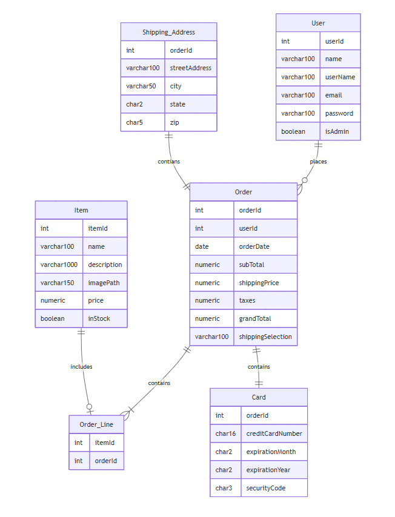
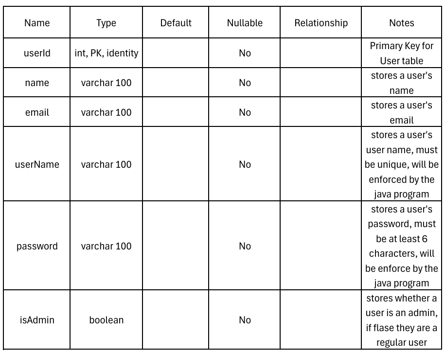
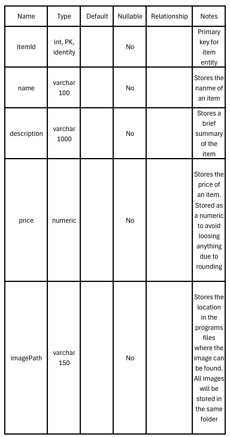
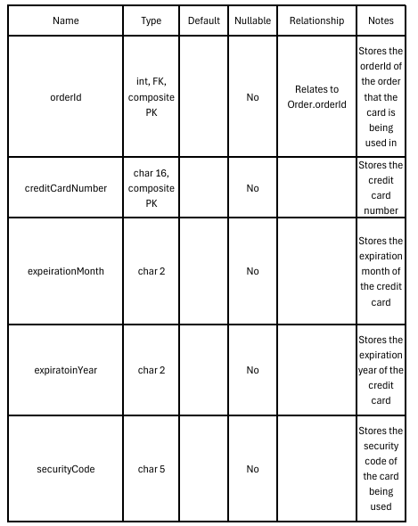
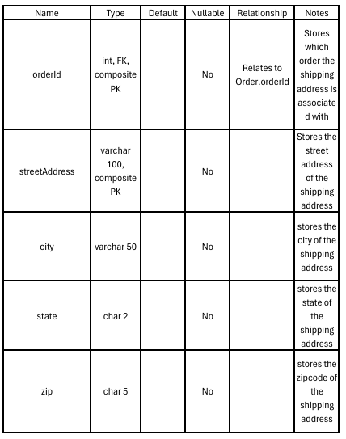

[< Back to Project Overview](../README.md)

# Technical Design
***

## Table of Contents
***
- [Languages](#languages)
- [Frameworks](#frameworks)
- [Data Storage Plan](#data-storage-plan)
- [Entity Relationship Diagram](#entity-relationship-diagram)
- [Entity/Field Descriptions](#entity/field-descriptions)
- [Data Examples](#data-examples)
- [Database Seed Data](#database-seed-data)
- [Authentication and Authorization Plan](#authentication-and-authorization-plan)
- [Coding Style Guide](#coding-style-guide)
- [Technical Design Presentation](#technical-design-presentation)

## Languages
***
The Peanut Gallery Art Store will be implemented in Java, HTML, and CSS.
- **Java**
  - We chose Java due to our team's familiarity with it, and it's support for the Java Spring Boot Framework which
    is specifically designed and widely used for web development.
  - Official Java documentation can be found [**here**](https://docs.oracle.com/en/java/)
- **HTML & CSS**
  - HTML and CSS were chosen due to their widespread use in web development and the fact that 
Spring Boot supports them in web development.
  - Official HTML documentation can be found [**here**](https://html.spec.whatwg.org/)
  - Official CSS documentation can be found [**here**](https://www.w3.org/TR/css-2025/)
- **SQL**
  - SQL will be used for reading from and writing to our database.
  - Official SQL documentation can be found [**here**](https://docs.oracle.com/en/database/oracle/oracle-database/26/cncpt/sql.html)

## Frameworks
***
Our team has chosen to use Spring Boot and Bootstrap as our frameworks for this project.
- **Spring Boot**
  - Spring Boot requires very little configuration and has built-in support for web applications.
  - Official documentation for Spring Boot can be found [**here**](https://docs.spring.io/spring-boot/index.html)
  - We will initialize our Spring Boot project from [**this source**](https://start.spring.io/)
- **Bootstrap**
  - Bootstrap has multiple features that we believe will be beneficial in styling our project:
    - Bootstrap contains prebuilt CSS classes, allowing us to stylize elements without writing custom CSS
    - Standardized components provide a consistent look across elements
    - It's possible to override default styles to customize elements to fit our use case
  - Official documentation for Bootstrap can be found [**here**](https://getbootstrap.com/docs/5.3/getting-started/introduction/)

## Data Storage Plan
***
For our project, we plan to use SQLite as our storage mechanism and JDBC to communicate with our database.
- **SQLite**
  - We chose SQLite for a few reasons:
    - KSU teaches SQL as part of its curriculum fairly early on in its degrees.
    - SQLite provides a serverless way to store our data, meaning that there will be no server management costs.
    - All data will be stored within the project on a single file, making it easy for updates to the data to be shared.
    - Official documentation for SQLite can be found [**here**](https://www.sqlite.org/docs.html)
- **JDBC**
  - In order to communicate with SQLite, our program will use a JDBC (Java Database Connectivity) driver. 
  - This is an API that will allow our Java program to interact with our SQLite database.
  - JDBC will allow for us to interact with our SQLite database the same way that you would any other SQL application
  - Official documentation for JDBC can be found [**here**](https://docs.oracle.com/javase/8/docs/technotes/guides/jdbc/)
  - Additional documentation can be found [**here**](https://en.wikipedia.org/wiki/Java_Database_Connectivity)
## Entity Relationship Diagram
***
Here you can see a diagram that visualizes the different entities, their attributes, and how they interact with each other

<!--
The code for the diagram in case i need to change it:
erDiagram
    User ||--o{ Order : places
    Order ||--|{ Order_Line : contains
    Item ||--o| Order_Line : includes
    User {
        int userId
        varchar100 name
        varchar100 userName
        varchar100 email
        varchar100 password
        boolean isAdmin

    }
    Order {
        int orderId
        int userId
        date orderDate
        numeric subTotal
        numeric shippingPrice
        numeric taxes
        numeric grandTotal
        varchar100 shippingSelection
        char16 creditCardNumber
        char2 cardExpirationMonth
        char2 cardExpirationYear
        char3 cardSecurityCode
        varchar100 shippingAddress
        varchar50 city
        char2 state
        char5 zip

    }
    Item {
        int itemId
        varchar100 name
        varchar1000 description
        varchar150 imagePath
        numeric price
        boolean inStock
    }
    Order_Line {
        int itemId
        int orderId
    }
-->
## Entity/Field Descriptions
***
Here you can see descriptions for each of the attributes present within each table.
 This will go over various aspects of each attribute including:
- Data Type
- Default Values
- Relationships to Other Tables
- Special Notes

The descriptions can be found bellow:
- **User:**

- **Item:**
 
- **Order:**
 
- **Card:**
 
- **Shipping Address**
 
- **Order Line:**
 
## Data Examples
***
This section contains some example data that you could potentially
see in each table to help give you an idea as to how each table
should look and how they are related to each other
## Database Seed Data
***
This section will include the data in each that the program will come with upon initial setup
## Authentication and Authorization Plan
***
- **Authentication**
  - When a user attempts to log in, we need to be able to determine who they are and retrieve the information relevant to their account.
  - This will be accomplished by running a SQL query to find the record that contains the provided username and password.
  - An instance of a User will then be created using the information retrieved form the query.
- Authorization
  - How will the system determine whether the user that just logged in is a regular user or an admin?
  - Within the User entity within our database, we will have a field called isAdmin. This field will track whether a specific user is an admin.
  - The Admin class within our program will use polymorphism to instantiate the current user as an instance of the Admin class instead of the User class.
  - For example, if a specific user is an admin, the system will run a check on the isAdmin attribute then execute the following line: User currentUser = new Admin();
## Coding Style Guide
***
There are a series of styling choices that every engineer is expected to follow that will be listed below:
 All engineers should follow the standard Java Style Guidelines which can be found [**here**](https://www.cs.cornell.edu/courses/JavaAndDS/JavaStyle.html)
 These guidelines should be followed to ensure that our code is easy to read and understand.
## Technical Design Presentation
***
A presentation going over our technical design can be found [**here**]()